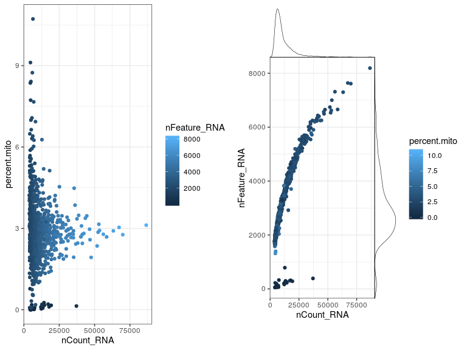
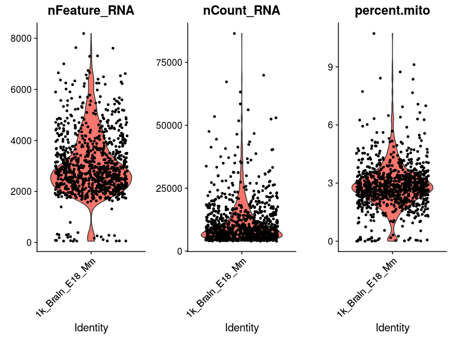

<!-- README.md is generated from README.Rmd. Please edit that file -->

# scpackages

<!-- badges: start -->

<!-- badges: end -->

The goal of scpackages is to integrate different R packages to perform
single cell RNA-seq analysis easily with minimum instructions. At
present it is based on only
[Seurat](https://satijalab.org/seurat/)

## Installation

<!-- You can install the released version of scpackages from [CRAN](https://CRAN.R-project.org) with: -->

<!-- ``` r -->

<!-- install.packages("scpackages") -->

<!-- ``` -->

<!-- And the development version from [GitHub](https://github.com/) with: -->

``` r
# install.packages("devtools")
devtools::install_github("vondoRishi/scpackages")
```

## Example

This is a basic example which shows you how to solve a common problem:

``` r
library(scpackages)
## basic example code
```

In this example we use the 10x data dowloaded from
[here](https://support.10xgenomics.com/single-cell-gene-expression/datasets/2.1.0/neurons_900)

## Initialize and QC

First initialize and QC Seurat object with single command. This will
also genarate QC plots

``` r
seurat_Obj <- read10XwithMarkergenes(
    tenxPath =  "/tmp/filtered_gene_bc_matrices/mm10/",
    pMin.cells = 3,
    pMin.features = 20,
    markerGenes = NULL,
    projectName = "1k_Brain_E18_Mm", 
    cellRangerAggregated = FALSE # If 10x data are aggrgated
)
```



## Filter

Now after inspecting the QC plots we want to keep good quality cells
only. That can be done with following commands.

``` r
seurat_Obj <- filterSeurat(seurat_Obj, 
                           mito.range = c(0, 5), # Cells with mitochondrial genes 0-5%
                           gene_range = c(1000,Inf) # Cells with more than 1000 genes 
                           )
#> [1] "Keeping cells with mitochndrial genes between  0,5 %  gene count within  1000,Inf  and umi count within  0,Inf"
```

## Report

The above commands can be run with different parameters or there could
be several samples. It could be difficult to make separate markdown file
for each object. Therefore we will use following command to genearate
markdown notes about the above resuts and save “seurat\_obj” for future
use.

``` r
report_QC(obj_scRNA = seurat_Obj,title = "1k_Brain_E18_Mm")
#> [1] "Saving data 1k_Brain_E18_Mm.12_February_2020.rds"
```

This will generate **1k\_Brain\_E18\_Mm\_currentDate.nb.html** report
with all information and figures. Additionally, it will also save
**seurat\_Obj** as 1k\_Brain\_E18\_Mm\_currentDate.rds for future use.
